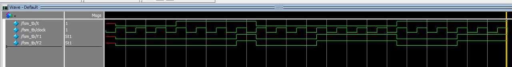

# 왜 안돼

Moore Machine은 잘 됐는데

Mealy Machine이 최초 Unknown 상태에서 빠져나오지를 못한다

 

그렇다고 initial로 Unknown을 처음부터 풀어준다면 의도한 동작이 나오질 않는다

혹여나 wire 이름을 x로 했다고 Unknown 취급 받은 코드가 있나 싶어 X로 전부 바꿔봤지만 결과는 동일

 

돌아버리겠다

2020/04/26) 고쳤다!!!

