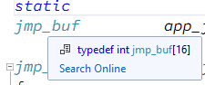

# setjmp, longjmp를 이용하여 내부적으로 exit 구현하기

C로 객체지향(특히 MVC)을 하는 기묘한 강의를 듣고 있다.

몇몇 과제를(심지어는 문제 몇개를 왜곡해서)

내 색깔을 진하게 해서 냈더니 평가 점수가 빵꾸가 났다.

 

그래서 지침에 맞게 다시금 MVC 프레임워크를 다시 짜고 있다.
```
#pragma once

#include <stdlib.h>

typedef struct {
	int    argc, result;
	char** argv;
} app_controller;

app_controller*    app_controller_create      (int argc, char* argv);
void               app_controller_run         (app_controller* self);
int                app_controller_get_result  (app_controller* self);
void               app_controller_delete      (app_controller* self);
```
코드1. app_controller.h

 

프로그램이 실행되면 바로 app_controller의 객체를 생성한 다음, app_controller_run 으로 제어를 넘겨 이 이후부터 원하는 코드를 실행하는 식이다.

 

따라서, app_controller 및 메서드에서 argc, argv를 사용할 수 있어야 하며 program exit code는 app_controller 내에서 결정되어야 한다.

 

`<stdlib.h>` 에는 exit 이라는 함수가 정의되어 있다. exit code로 사용될 인자로 int값을 받아 프로그램을 그 즉시 종료하는 함수이다. 당연히 app_controller 내에서도 exit() 을 사용한다면 충분히 목적은 달성할 수 있다.

 

그러나 기왕 MVC 구조를 사용하는 김에 좀 더 멋있는 구조를 만들고 싶었다. 만일 같은 Translating Unit 내라면 goto로 충분히 가능할 수도 있다. 하지만 main()이 있는 파일과 app_controller()의 구현이 있는 파일은 서로 다른 TU에 위치해 있다. 이 경우에는 goto를 사용하지 못한다.

 

이 때 사용할 수 있는 것 중 하나가 바로 setjmp, longjmp가 되겠다.

일단 app_controller.h를 조금 고쳐보자.
```
#pragma once

#include <stdlib.h>
#include <setjmp.h> // setjmp, longjmp

typedef struct {
	int    argc, result;
	char** argv;
} app_controller;

app_controller*    app_controller_create      (int argc, char* argv);
void               app_controller_run         (app_controller* self);
// app_controller 내에서 사용할 exit() 메서드
void               app_controller_exit        (app_controller* self, int status);
int                app_controller_get_result  (app_controller* self);
void               app_controller_delete      (app_controller* self);
 ```

그리고 main.c도 조금 고치자.
```
#include <mvc/app_controller.h>           // app_controller

int main(int argc, char* argv[])
{
    int             result     = 0;
    app_controller* controller = app_controller_create(argc, argv);
    
    if (setjmp() == 0) {
        app_controller_run(controller);
    	
        result = app_controller_get_result(controller);
        app_controller_delete(controller);
    }

    return result;
}```
setjmp를 이용해서 0일 경우 app_controller_run을 이용해 본 로직을 실행하게 해줬다.

하지만 setjmp의 경우(후술할 longjmp도) jmp_buf 타입의 상태 보관 변수를 인자로 받는다. 따라서 이 코드는 빌드되지 않는다.
```
#include <mvc/app_controller.h>           // app_controller

jmp_buf  app_jmp_state;  // 추가해준다.

int main(int argc, char* argv[])
{
    int             result     = 0;
    app_controller* controller = app_controller_create(argc, argv);
    
    if (setjmp(app_jmp_state) == 0) {
        app_controller_run(controller);
    	
        result = app_controller_get_result(controller);
        app_controller_delete(controller);
    }

    return result;
}```
그럼 전역변수로 만들어주자. 이제 해결 되었을까?

 

이제 나는 app_controller.c에 app_controller_exit의 구현을 작성할 것이다.
```
#include <mvc/app_controller.h>

// exit(int) 구현
void app_controller_exit(app_controller* self, int status)
{
    self->result = status;
    longjmp(/*jmp_buf required*/, status);
}```
보다시피 setjmp한 위치로 longjmp 해야하는데, setjmp한 app_jmp_state를 어디서 가져와야 할 지 아리송해진다.

 

몰론, app_controller.c에서 extern jmp_buf app_jmp_state; 해주면 깔끔하다.

하지만 extern 키워드는 "이 파일 안에 없지만 아무튼 어딘가에 있으니까 링킹하면서 찾아봐라" 라는 식의 의미이다.

이런건 아름답지 못하다. 객체지향적으로 한번 해보자.

 

app_jmp_state는 app_controller.c 로 옮긴다. 다른 파일에서 extern으로 함부로 사용할 수 없게 static을 붙여주자.
```
#include <mvc/app_controller.h>

static jmp_buf app_jmp_state; //main.c에서 훔쳐왔다.

// exit(int) 구현
void app_controller_exit(app_controller* self, int status)
{
    self->result = status;
    longjmp(app_jmp_state, status);
}```
그런데 이러면 또 main.c에서 사용할 수 없다. 따라서 app_jmp_state를 빌려올 방법이 필요하다.

 

app_controller.h에 jmp_buf의 포인터를 리턴하는 함수 app_jmp_env의 프로토타입을 만든다.
```
#pragma once

#include <stdlib.h>
#include <setjmp.h> // setjmp, longjmp

typedef struct {
	int    argc, result;
	char** argv;
} app_controller;

// app_jmp_state를 땡겨오기 위한 함수
jmp_buf*           app_jmp_env                ();  

app_controller*    app_controller_create      (int argc, char* argv);
void               app_controller_run         (app_controller* self);
// app_controller 내에서 사용할 exit() 메서드
void               app_controller_exit        (app_controller* self, int status);
int                app_controller_get_result  (app_controller* self);
void               app_controller_delete      (app_controller* self);
 ```

app_controller.c에 app_jmp_env의 구현을 작성한다.
```
#include <mvc/app_controller.h>

static jmp_buf app_jmp_state; //main.c에서 훔쳐왔다.

jmp_buf* app_jmp_env()
{
    return &app_jmp_state;
}

// exit(int) 구현
void app_controller_exit(app_controller* self, int status)
{
    self->result = status;
    longjmp(app_jmp_state, status);
}```
여기서 아리송한 것은, jmp_buf는 int[16]의 다른 이름이다.(typedef)

 


일단 MSVC에서는 그렇다.


따라서 그냥 jmp_buf를 리턴하면 되지 않을까 라고 생각하겠지만 jmp_buf는 배열이고, C는 함수에서 배열을 return 직접 리턴할 수 없다. (물론 out parameter 등의 꼼수를 사용하면 되겠지만 side effect는 예쁘지 못하다.)

 

따라서 jmp_buf의 포인터를 리턴하면 깔끔하겠다.
```
#include <mvc/app_controller.h>           // app_controller

int main(int argc, char* argv[])
{
    int             result     = 0;
    app_controller* controller = app_controller_create(argc, argv);
    
    if (setjmp(*app_jmp_env()) == 0) { // app_jmp_env의 리턴값을 deference 해준다.
        app_controller_run(controller);
    	
        result = app_controller_get_result(controller);
        app_controller_delete(controller);
    }

    return result;
}
 ```

main.c로 돌아와서 setjmp 안에 app_jmp_env을 호출해주면 되겠다.

물론 포인터를 뱉으니 *로 dereference 해주는 것을 잊지 말자.

 

아니다. 그냥 main의 로컬로 jmp_buf 변수를 선언해서 받아오는 편이 더 깔끔할 것 같다.
```
#include <mvc/app_controller.h>           // app_controller

int main(int argc, char* argv[])
{
    // 로컬로 jmp_buf 선언
    // app_jmp_env의 리턴값을 deference 해준다.
    int             result     = 0;
    jmp_buf         jmp_state  = *app_jmp_env();
    app_controller* controller = app_controller_create(argc, argv);
    
    if (setjmp(jmp_state) == 0) { 
        app_controller_run(controller);
    	
        result = app_controller_get_result(controller);
        app_controller_delete(controller);
    }

    return result;
}
 ```

... 그런데 실행해보니 생각처럼 잘 안된다. (return이 0으로 고정된다)

살펴보니 한가지 실수한게 있었는데 result = app_controller_get_result를 if 문 안에 둔 것.

 

이러면 app_controller_run(controller) 밑에 있는 코드들은 실행이 안되니 당연히 종료 코드가 0으로 고정된 것이었다.

 
```
#include <mvc/app_controller.h>           // app_controller

int main(int argc, char* argv[])
{
    // 로컬로 jmp_buf 선언
    // app_jmp_env의 리턴값을 deference 해준다.
    int             result     = 0;
    jmp_buf         jmp_state  = *app_jmp_env();
    app_controller* controller = app_controller_create(argc, argv);
    
    if (setjmp(jmp_state) == 0) { 
        app_controller_run(controller);
    }
    
    // setjmp 밖으로 빼준다.
    result = app_controller_get_result(controller);
    app_controller_delete(controller);

    return result;
}
```
이렇게 수정하자.