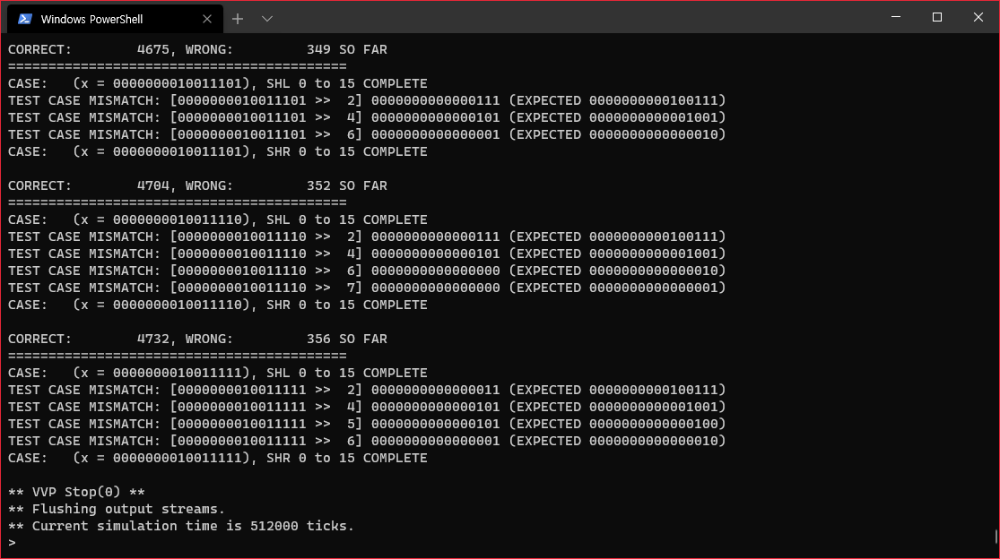
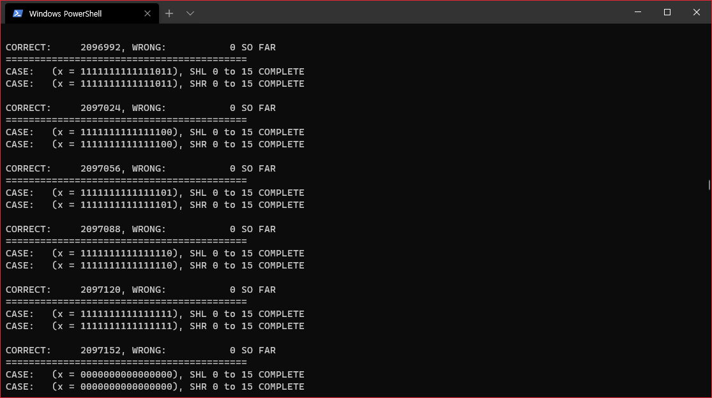

# [Verilog] Behavioral Style Design에서 간과하기 쉬운 실수

HDL을 이용해서 하드웨어 설계를 하는 방법은 주로 3가지가 제시된다.

 

 - Structural Style

 - Dataflow Style

 - Behavioral Style

 

Structural Style은 Block Diagram 등을 이용해서 설계한 대로 기술하는 방법이고 (모듈 선언을 주로 이용), Dataflow Style은 데이터 흐름에 중점을 둔 방법이며 (주로 assign을 이용), Behavioral Style은 always 문을 이용해서 특정 동작(값이 변경되거나 클럭이 posedge or negedge가 되는 등)을 중심으로 한 방법이다.

 

Verilog에서 always문은 다음과 같은 방식으로 사용한다.
```
always @(condition) begin
    // statements...
end
```
condition에는 always begin ... end 사이에 기술된 동작을 실행할 조건을 명시하는데, 가끔 이런 조건을 잘못 명시하거나 부족하게 명시할 경우 잘못된 동작을 일으킬 수 있다.

 

오늘 16비트 Barrel Shifter (Left/Right) 를 구현했는데, Shift Left까지는 분명 테스트를 통과했다.

그런데 Shift Right를 구현하는 과정에서 테스트를 통과하지 못했는데 이상한건 테스트를 통과하지 못하는 시점이 케이스마다 천차만별이었다는 것이다.

 

Shift Left는 간단했다. 강의 자료에서 제시한 대로, 컨트롤 신호 3개를 주고 매 Stage마다 1, 2, 4씩 넘겨주거나 말거나 하면 된다. 모든 테스트 케이스를 통과했는지 확인하고 Shift Right를 구현했다.

 

당연히 Shift Right는 Shift Left의 반대로 동작하게 설계하면 될 것이다. 다만 이제 Shift Left 회로에 통합하기 위해서 2-to-1 MUX를 3-to-1 MUX로 변경하고, Shift 방향을 바꿔줄 수 있는 컨트롤 신호를 하나 더 추가하는 것으로 충분하다.
```
module mux_31(out, x, y, z, sel0, sel1);
    output out;
     input  x, y, z, sel0, sel1;
     
     reg    out;
     
     always @(x or y or sel0 or sel1) begin
        if (sel1 == 0) begin
            if      (sel0 == 0) out = x;
            else if (sel0 == 1) out = y;
            else                out = 1'bx;
        end
        else if (sel1 == 1) begin
            if      (sel0 == 0) out = x;
            else if (sel0 == 1) out = z;
            else                out = 1'bx;
        end
        else out = 1'bx;
     end
endmodule
```
기존의 2-to-1 MUX에서 추가된건 z, sel1이고 탑 모듈에서도 적절하게 고쳐주었다.

그리고 테스트를 돌려보니...

 


SHR에서 온갖 CASE MISMATCH가 발생하고 있었다.

 

특이할 만한 점은 SHR 2~8 범위 내에서 주로 MISMATCH가 발생했다는건데, 아무리 MUX 트리를 살펴봐도 오류가 날 만한 껀덕지는 보이지 않았고 참다못해 반 버리다 시피한 Quartus에서 Synthesis를 돌려보았다.
```
Warning (10235): Verilog HDL Always Construct warning at shifter_16b_top.v(16): variable "z" is read inside the Always Construct but isn't in the Always Construct's Event Control
```
z가 always 문 안에서 접근되는데 always에서 감시하고 있지 않다는 이야기이다.

그제서야 always문을 다시 보니...
```
     always @(x or y or sel0 or sel1) begin
```
조건문에 z를 빼놓고 있었던 것이다.

그렇다보니 z값이 변하더라도 나머지가 변하지 않으면 MUX는 동작하지 않는다. 
```
     always @(x or y or z or sel0 or sel1) begin
```
이렇게 고쳐준 결과....

 


 

모든 케이스에 대해서 Shift Left 및 Shift Right가 정상적으로 동작함을 확인할 수 있었다.

 

그러므로, always문을 사용할 때는 안쪽에 사용된 변수나 wire들에 대해 제대로 명시해주는 버릇을 들이자.

그리고 순차회로라면 반드시 클럭을 빼먹지 말도록 하자.