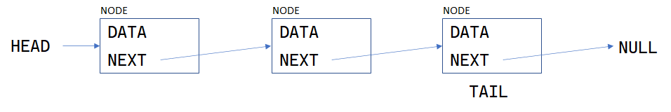
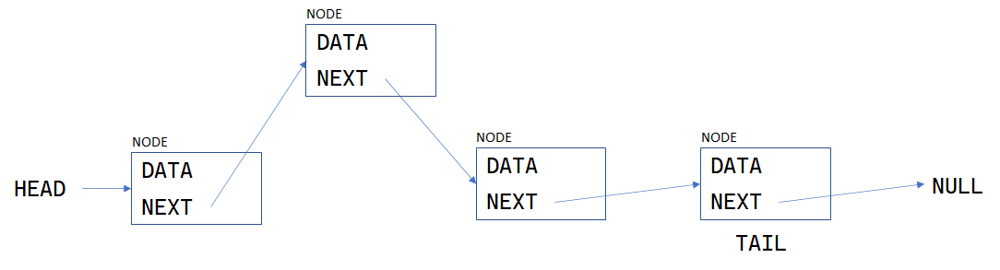
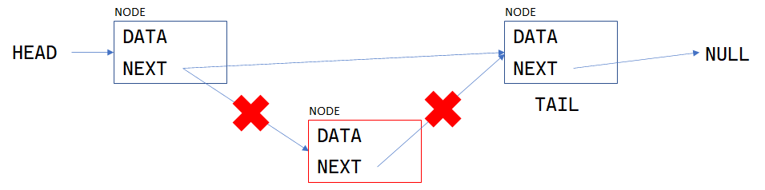

# Linked List

## Abstract
링크드 리스트는 스택이나 큐, 트리 등과 마찬가지로 그 이름이 매우 정직한 자료구조다.

구현 자체도 간단한 축에 속하며 어떻게 변형하냐에 따라 트리나 그래프가 될 수도 있는 다재다능한 덕에,

컴퓨터를 공부했다는 사람 치고 모르는게 이상할 정도다.

 

## Overview

링크드 리스트는 배열 리스트와 달리, 저장된 데이터가 메모리상에서 연속적으로 배치됨을 보장하지 않는다.

개별 데이터는 노드라는 형태로 저장되며, 이 노드는 저장하고자 하는 데이터와 함께 다음 노드의 주소를 갖는다.

 

링크드리스트의 첫 노드를 HEAD라고 하며, 마지막 노드를 TAIL 이라고 부른다. TAIL의 NEXT는 항상 NULL이 된다.

 

## Accessing
배열 리스트는 배열의 특성상 데이터가 연속적으로 배치된다. 따라서 임의 접근을 통해(arr[3] 하는 식으로) O(1)의 복잡도로 데이터에 접근할 수 있다.

 

그러나 링크드리스트는 그렇지 못하다. 예를 들어, 3번째 요소에 접근해야 한다면

HEAD로부터 시작해서 HEAD의 NEXT를 지나
그 NEXT의 NEXT를 지나
또 그 NEXT의 NEXT를 지나야 한다.
따라서 링크드리스트에서의 데이터 접근은 O(n)의 복잡도를 가진다.

 

## Insert/Delete
반면 삽입, 삭제의 경우 이야기가 다르다. 개별 노드는 NEXT라는 이름으로 다음 노드의 주소를 가지고 있다.

 

배열리스트의 경우 중간에 삽입한다면 그 뒤의 원소들을 한칸씩 뒤로 밀어낸 다음 넣어야 하거나

혹은 삭제한다면 삭제 후 앞으로 당겨놓아야 했지만 링크드리스트의 경우 이전 노드의 NEXT를 조정해주기만 하면 된다.

 

 

삽입하는 경우 이전 노드의 NEXT를 새로 삽입될 노드를 가리키도록 조정해주고, 새로 삽입된 노드의 NEXT를 이전 노드가 가리키던 NEXT로 조정해주면 된다.

 

반면 삭제하려는 경우에는 이전 노드의 NEXT를 NEXT(삭제될 노드)의 NEXT로 바꾸기만 하면 된다.

 

물론, 삽입이나 삭제를 위해 대상 노드와 이전 노드를 탐색해야 하지만 삽입과 삭제만 놓고 볼 경우 상수시간 내에 처리되므로 O(1)의 복잡도를 가진다고 할 수 있다.